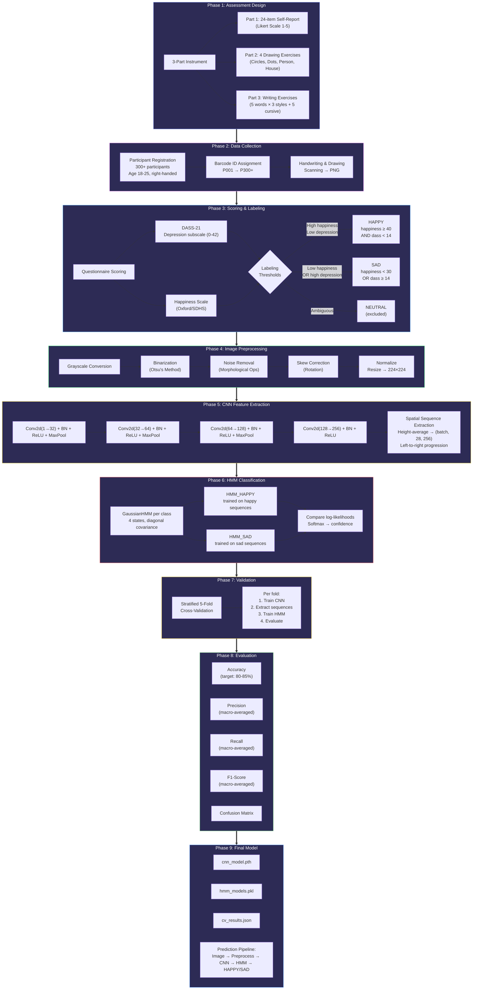

# INSIDE-OUT: Thesis Process Map

> Emotion Recognition through Handwriting Analysis using CNN-HMM Hybrid Approach
> Cyrel Jane A. Edaño — University of San Carlos, DCISM

## Process Flow (Mermaid)



## Data Flow Summary

```
Assessment → Scan → Score → Label → Preprocess → CNN Features → HMM Classify → 5-Fold CV → Evaluate → HAPPY/SAD
```

## Tech Stack

| Category | Tools |
|----------|-------|
| Deep Learning | PyTorch, torchvision |
| Sequence Modeling | hmmlearn (GaussianHMM) |
| Image Processing | OpenCV, Pillow |
| ML & Evaluation | scikit-learn |
| Data | pandas, numpy |
| Visualization | matplotlib, seaborn |
| Platform | Google Colab (GPU), Google Drive |
| Psychometrics | DASS-21, Oxford/SDHS |

## Key Parameters

| Parameter | Value |
|-----------|-------|
| Image size | 224×224 grayscale |
| CNN features | 256-dimensional |
| HMM states | 4 per class |
| HMM covariance | Diagonal |
| Sequence length | 28 timesteps (spatial columns) |
| Batch size | 32 |
| Learning rate | 0.001 |
| Early stopping | patience = 10 |
| Cross-validation | 5-fold stratified |
| Target accuracy | 80-85% |
